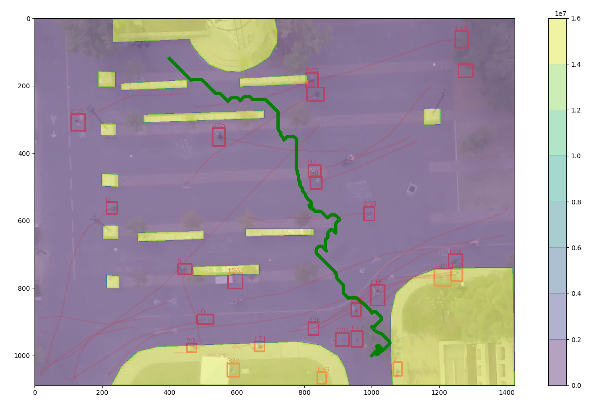

# SocAwNav782
16782 Planning project using Stanford Drone Dataset

## Getting Started

These instructions will get you a copy of the project up and running on your local machine for development and testing purposes.

### Setup

This project was tested on Ubuntu 16.04. Follow the guide below to setup the code:

### C++ Libraries

Install [XTL](https://github.com/QuantStack/xtl)

```
git clone https://github.com/QuantStack/xtl.git
cd xtl
git checkout 4cc4a9d1028288435cce9d0188da5650651c98e1
mkdir build
cd build
cmake .. -DCMAKE_INSTALL_PREFIX=/usr/local
sudo make install
cd
```

Install [xtensor](https://github.com/QuantStack/xtensor)

```
git clone https://github.com/QuantStack/xtensor.git
cd xtensor
mkdir build
cd build
cmake .. -DCMAKE_INSTALL_PREFIX=/usr/local
sudo make install
cd
```

Install [pybind11](https://github.com/pybind/pybind11/)

```
git clone https://github.com/pybind/pybind11.git
cd pybind11
mkdir build
cd build
cmake .. -DCMAKE_INSTALL_PREFIX=/usr/local
sudo make install
cd
```

Install [xtensor-python](https://github.com/QuantStack/xtensor-python)

```
git clone https://github.com/QuantStack/xtensor-python.git
cd xtensor-python
mkdir build
cd build
cmake .. -DCMAKE_INSTALL_PREFIX=/usr/local
sudo make install
cd
```


```
pip install numpy
pip install matplotlib
pip install 
```


#### Building the C++ module for python export

```
c++ -O3 -Wall -shared -std=c++14 -fPIC `python3 -m pybind11 --includes` -I/usr/local/lib/python3.5/dist-packages/numpy/core/include search.cpp -o search`python3-config --extension-suffix`

cp search.cpython-35m-x86_64-linux-gnu.so utils/
```

### Dataset requirements

This code requires that you download the [Stanford Drone Dataset](http://vatic2.stanford.edu/stanford_campus_dataset.zip) (~70G download!) and place it in a directory named `dataset` in the main folder.

## Running the demo

Once done run:
``` bash
cd utils
python3 data_utils.py
```

<a href="http://www.youtube.com/watch?feature=player_embedded&v=aBGHSeXeBdE" target="_blank"></a>